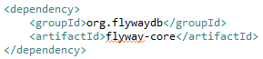
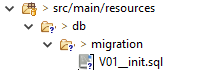

# spring-boot-flyway-example
Basic example of using Flyway dependency in a spring boot project.

## Requirements
   * Spring Boot 2.x
   * Java 8
   * MySql
   * Lombok
   
## Baby steps
* Include dependency on the project.

    

* Create hierarchical structure.

    
    
* Create sql migration file following the nomenclature, ex:

  V01__migration_description.sql

* When executing the application the migration will be executed.

## Current Version
0.1
___
Pedro Polonea
